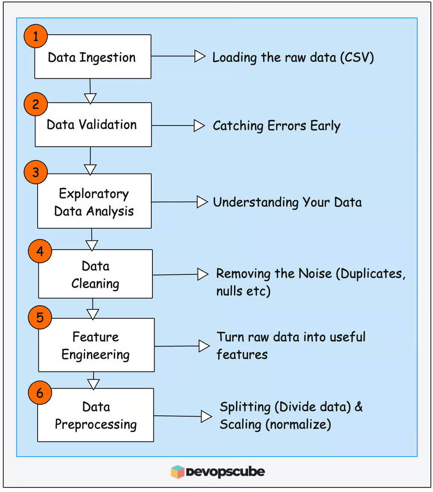

# MLOps Step 2: Data Preparation (Hands On)

## Need for Data Preparation
In [1.md](https://github.dev/Aditya-gairola/MLOps/tree/main/1.md) , we looked at the dataset pipeline and ended up with a clean 300MB CSV file (dataset). One row per employee, pulled from HRMS, payroll, and performance systems. 

Now here is the thing. That 300MB CSV is not ready for training a model yet. It still has problems that need fixing and transformations that need to happen before a machine learning model can learn anything useful from it.

That is exactly what the Data Preparation Pipeline does. It takes our raw dataset, explores it, cleans it up, and converts it into final training and test files that a machine learning model can work with.

## Data Preparation Stages 
The following image illustrates the data preparation stages in our ML lifecycle. Overall these stages collects data, explore patterns, cleans data and creates useful features.

 

 